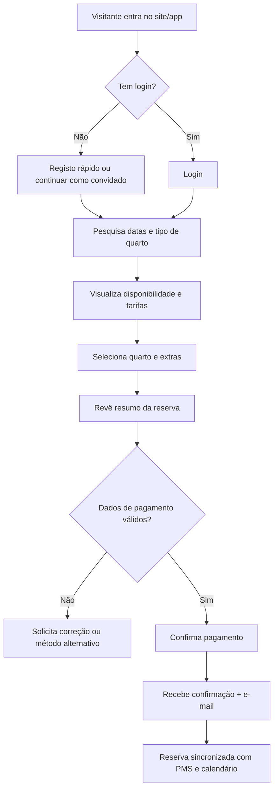

# User Flows - Plataforma de Gestão Hoteleira

Este documento descreve fluxos principais para apoiar reservas, calendário, housekeeping e faturação, garantindo consistência entre touchpoints web e mobile.

## Fluxo de Reserva


### Pontos de atenção
- Capturar preferências do hóspede (hora de chegada, pedidos especiais) no passo G.
- Disponibilizar upsell de experiências locais e upgrade de quarto no passo F.
- Reforçar mensagem de confiança e cancelamento flexível durante o passo H.

## Fluxo de Calendário Operacional
```mermaid
flowchart TD
    A[Staff inicia sessão no dashboard] --> B[Seleciona módulo Calendário]
    B --> C[Aplica filtros (tipologia, estado, housekeeping)]
    C --> D[Visualiza ocupação em vista diária/semana/mês]
    D --> E{Há conflito ou overbooking?}
    E -- Sim --> F[Recebe alertas + sugestões de resolução]
    E -- Não --> G[Atualiza bloqueios/maintenance]
    F --> H[Resolve conflito (realocar, contactar hóspede)]
    G --> I[Calendário sincroniza com reservas e housekeeping]
    H --> I
    I --> J[Confirmação visual do estado atualizado]
```

### Pontos de atenção
- Destacar claramente estadias VIP e grupos com códigos de cor.
- Permitir impressão/exportação para equipas offline.

## Fluxo de Housekeeping
```mermaid
flowchart TD
    A[Supervisor acede ao dashboard] --> B[Revê ocupação e prioridades]
    B --> C[Distribui tarefas por equipa/quartos]
    C --> D[Equipa recebe checklist no mobile]
    D --> E{Tarefa concluída?}
    E -- Não --> F[Reporta bloqueio (manutenção, objeto perdido)]
    E -- Sim --> G[Atualiza estado para "Pronto" ou "Inspecionar"]
    F --> H[Supervisor recebe alerta]
    H --> I[Reatribui ou agenda manutenção]
    G --> J[PMS e front desk atualizados em tempo real]
    I --> J
    J --> K[Logs e métricas atualizados]
```

### Pontos de atenção
- Offline-first no mobile para zonas sem rede.
- Fotos rápidas para provas de limpeza/avarias.

## Fluxo de Faturação
```mermaid
flowchart TD
    A[Hóspede inicia checkout] --> B[Recolha de consumo (bar, minibar, spa)]
    B --> C[PMS agrega despesas por quarto]
    C --> D[Front desk valida encargos e descontos]
    D --> E{Empresa/Grupo?}
    E -- Sim --> F[Aplica faturação dividida e envia fatura ao responsável]
    E -- Não --> G[Gera fatura única com impostos corretos]
    F --> H[Processa pagamento via gateway ou faturação a prazo]
    G --> H
    H --> I[Entrega recibo digital + integrações contabilidade]
    I --> J[Dashboard financeiro atualiza métricas em tempo real]
```

### Pontos de atenção
- Automatizar regras fiscais por país/região.
- Integrar com soluções de contabilidade e ERP.

## Dependências Comuns
- Integração bidirecional com PMS e channel manager.
- Notificações em tempo real (e-mail, SMS, push) geridas por serviço central.
- Logs e trilhas de auditoria acessíveis ao compliance.

