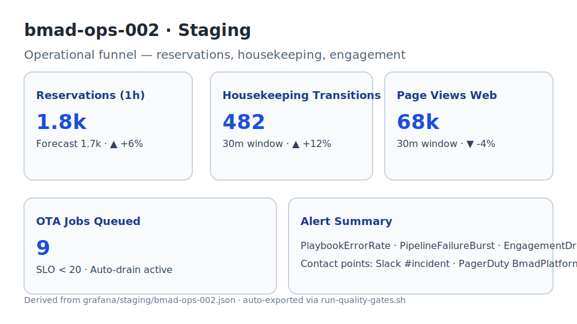
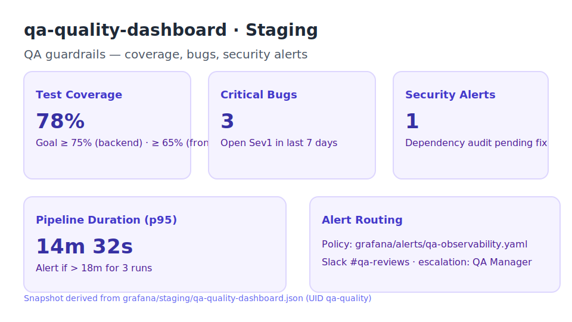

# Grafana Dashboards Snapshots

Esta pasta armazena capturas atualizadas dos dashboards críticos monitorados pela equipe de Observabilidade. Cada artefato foi gerado a partir das versões versionadas em `grafana/staging/*.json` e resume os indicadores acompanhados pelos alertas críticos descritos no runbook `docs/runbooks/alertas-criticos.md`.

| Dashboard | Screenshot | Escopo | Alertas | Observações |
| --- | --- | --- | --- | --- |
| `bmad-agents-001` |  | Saúde dos agentes (latência P95, throughput HTTP, taxa de erro 5xx, jobs em fila) | Regras `PlaybookErrorRate`, `PipelineFailureBurst`, `EngagementDrop` (rota `#incident`, PagerDuty `BmadPlatformStaging`) | Painel com filtros por `environment` e `service`; atualizar semanalmente após auditoria de SLOs. |
| `bmad-ops-002` |  | Funil operacional de reservas, transições housekeeping, engajamento web | Mesmo conjunto de alertas críticos (Grafana Alerting) | Utilizar script `scripts/run-quality-gates.sh` para exportar JSON e anexar evidências a incidentes. |
| `qa-quality-dashboard` |  | Gates de qualidade QA (cobertura, bugs críticos, alertas de segurança, duração pipeline) | Policy `qa-observability.yaml` (rota `#qa-reviews`) | Verificar thresholds alinhados às métricas oficiais de QA (`docs/testing-strategy.md`). |

> ℹ️  Sempre que novas métricas forem adicionadas aos dashboards versionados, exporte a captura atualizada e substitua os arquivos `.svg` correspondentes para manter a documentação sincronizada.
